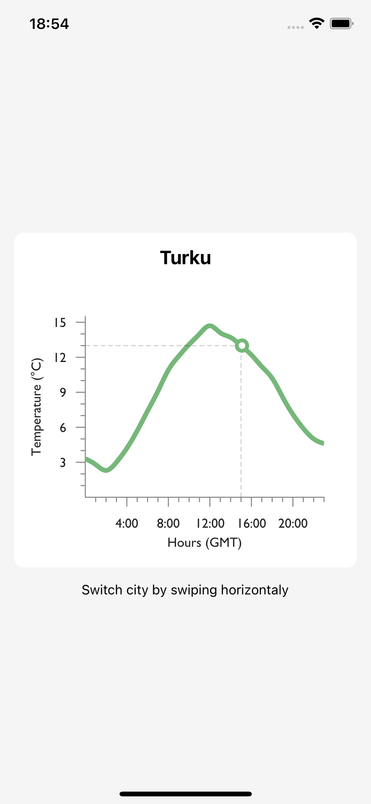
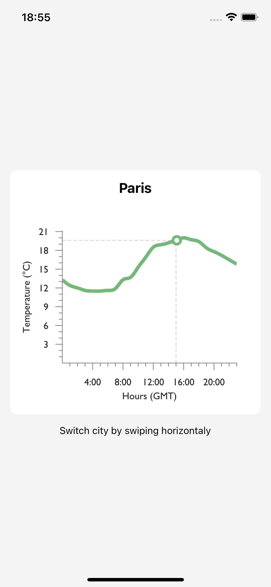
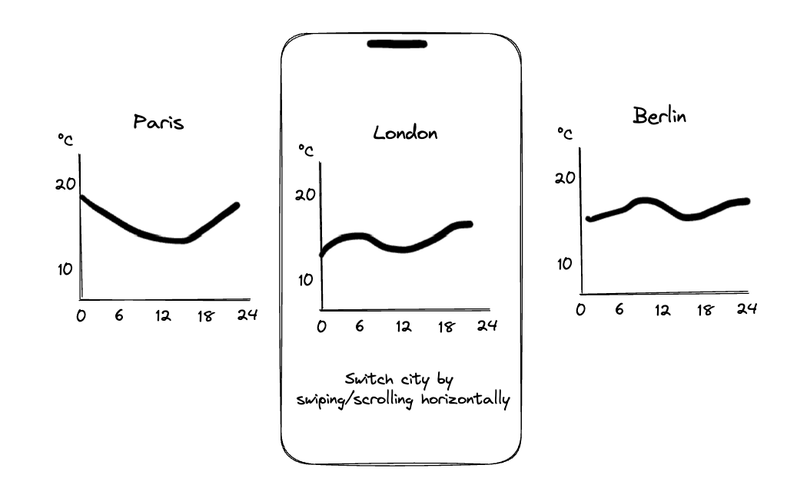

# Veri Mobile Frontend Challenge Graph

## Interesting features of my solution:

### Modulatization

Have organized the code into seperate files for **components, screens, hooks, utils, types and constants.**
I've followed a modular approach and had the **single-responsability principal** in mind for better code organization, maintainability, and readability.

### Chart component

Built a custom chart component, `WeatherChart`, using the **victory-native** library to display the weather data. the chart component has dynamic domain for better accuracy and includes a "now" indicator, which shows the current temperature for better chart readability and user experience.

### Optimized list (Fetching and loading strategy)
Added lazy loading to the flat list, so at first it loads 3 of the items and then loads 3 more. and after that with each scroll, loades the next item of the list.

### Caching strategy

Implemented a caching strategy using **AsyncStorage** to store fetched data for each city. when retreiving, the data would be **validated** and if not valid, it would be removed from the storage as well as fetching the new data.

### Custom hook
Implemented a custom hook `useFetchWeather` to separate the logic of fetching and caching from the presentation layer.

### Screenshots

